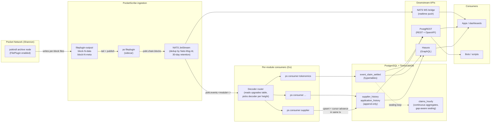
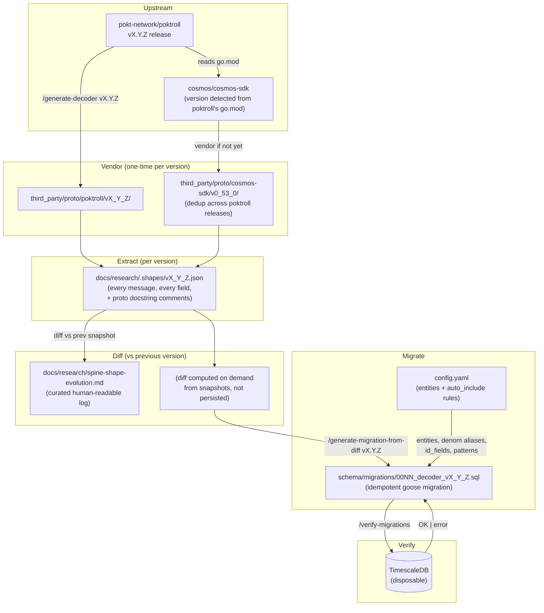
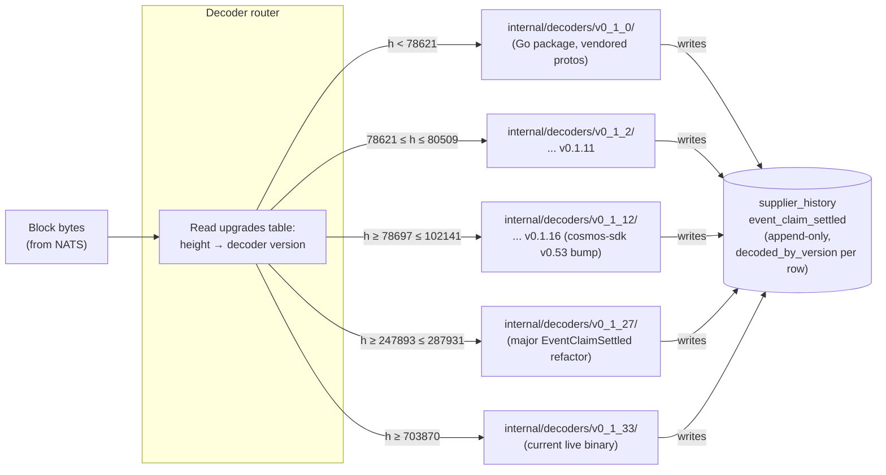
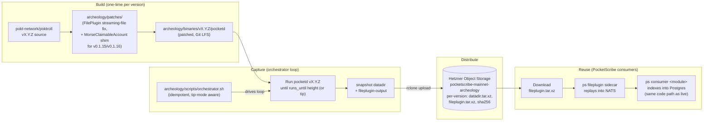

# PocketScribe — System Flow

> The high-level view. What PocketScribe is, what it produces, and how the
> pieces talk to each other. Each diagram below is a different lens on the
> same system.

## What is PocketScribe?

**A Go-native indexer for Pocket Network's Shannon protocol.** It turns the
firehose of chain events into a queryable Postgres + TimescaleDB store, with
GraphQL (Hasura), REST (PostgREST), and realtime (NATS WebSocket bridge)
endpoints hanging off it. It replaces the SubQuery-based Pocketdex with
something that is:

- **Stream-first** — every block flows through NATS JetStream, never polled.
- **Append-only** — entity history is a sequence of snapshots; never UPDATE,
  never `valid_to_height`.
- **Version-aware** — one decoder per poktroll release, dispatched per block
  by an upgrades table.
- **Self-hosted** — no cloud lock-in, no managed analytics DB.
- **Reproducible** — replay any height range from the canonical FilePlugin
  archive without re-syncing the chain.

---

## Diagram 1 — Live ingestion (the runtime path)

**Key invariants** (see [ADR-005](../decisions/ADR-005-append-only-pure.md),
[ADR-006](../decisions/ADR-006-chain-as-source-of-truth.md),
[ADR-010](../decisions/ADR-010-height-and-time-invariant.md)):

- Every row carries `(block_height, block_time)` from the chain consensus header.
- Consumer pattern: BEGIN tx → upsert → cursor advance → COMMIT → THEN ack NATS.
  Crash anywhere → idempotent replay → no duplicates, no gaps.
- "Current" = `DISTINCT ON (id) ... ORDER BY block_height DESC` view over
  the history table. No materialized "current" column.

---

## Diagram 2 — Schema generation pipeline (the unique part)

PocketScribe's schema is **generated from poktroll's protobuf shapes**, not
hand-authored. When poktroll releases a new version, three skills produce
the new SQL — no human writes a CREATE TABLE.

**Result**: schema covers 244 tables across both poktroll-specific entities
(Supplier, Application, EventClaimSettled, …) and cosmos-sdk core (BaseAccount,
Validator, Proposal, …). All idempotent. All validated against TimescaleDB.

See [ADR-028](../decisions/ADR-028-schema-versioning-strategy.md) for the
full design.

---

## Diagram 3 — Decoder version routing (runtime)

Every block lives in exactly one version range. The router reads the
`upgrades` table (chain-driven, see [ADR-018](../decisions/ADR-018-no-hardcoded-upgrades.md))
and dispatches the block's bytes to the right per-version decoder package.

The `decoded_by_version` column on every row provides indelible audit:
**"this row was interpreted by this version's Go code"**. Debugging a NULL
field reduces to "did this version's shape even have it?" — answer in O(1).

---

## Diagram 4 — Archeology pipeline (how we got the initial substrate)

A one-shot effort: capture per-version FilePlugin output for every poktroll
release that ran on mainnet. The output is uploaded to a Hetzner bucket
and is the canonical input PocketScribe replays — there's no way to
re-derive it from genesis because of the known historical replay
discontinuity (see [ADR-021](../decisions/ADR-021-shannon-history-discontinuity.md)).

After v0.1.34 goes live, future captures switch to the **stock** poktroll
binary (Otto's FilePlugin fix landed in mainline); the patched-binary
archeology layer becomes obsolete and we move to live-tail capture.

See [archeology/README.md](../../archeology/README.md) and
[archeology/FINDINGS.md](../../archeology/FINDINGS.md) for the operational
detail.

---

## How to read the rest of the docs

| Topic | Doc |
|---|---|
| Why these choices? | [`docs/decisions/`](../decisions/) — 22 ADRs |
| Detailed subsystem design | [`docs/architecture/`](.) — 10 documents |
| Investigation notes | [`docs/research/`](../research/) |
| What exists today (vs planned) | [`STATUS.md`](../../STATUS.md) |
| How a contributor adds a module | [`CONTRIBUTING.md`](../../CONTRIBUTING.md) |
| The full plan | [`ROADMAP.md`](../../ROADMAP.md) |
| Schema artifacts | [`schema/migrations/`](../../schema/migrations/) — 38 files |
| Skill internals | [`.claude/skills/`](../../.claude/skills/) — 4 skills |
| Archeology run output | [`archeology/`](../../archeology/) — patches, binaries (LFS), scripts |
